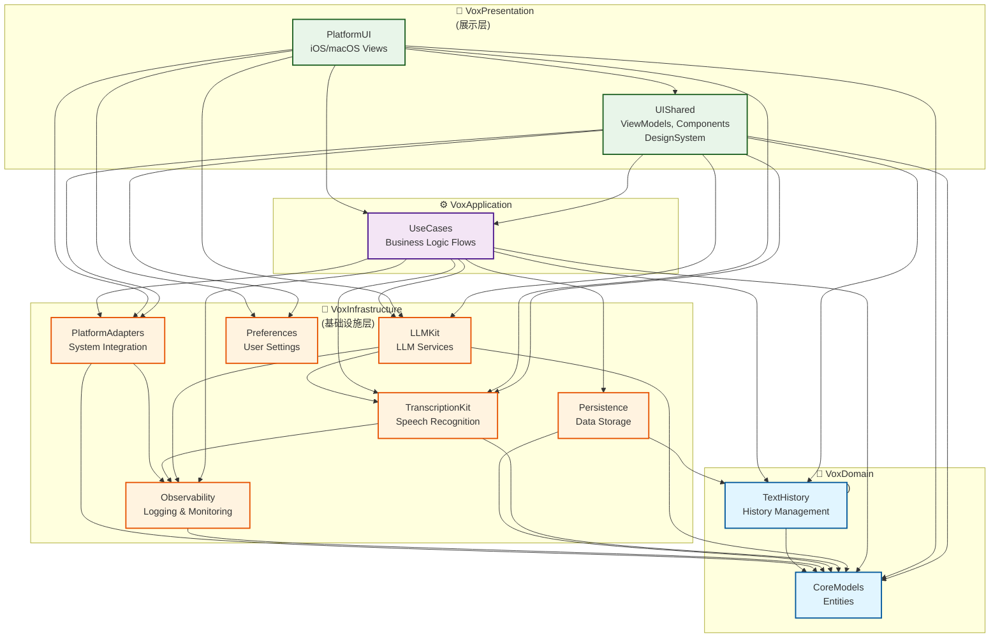
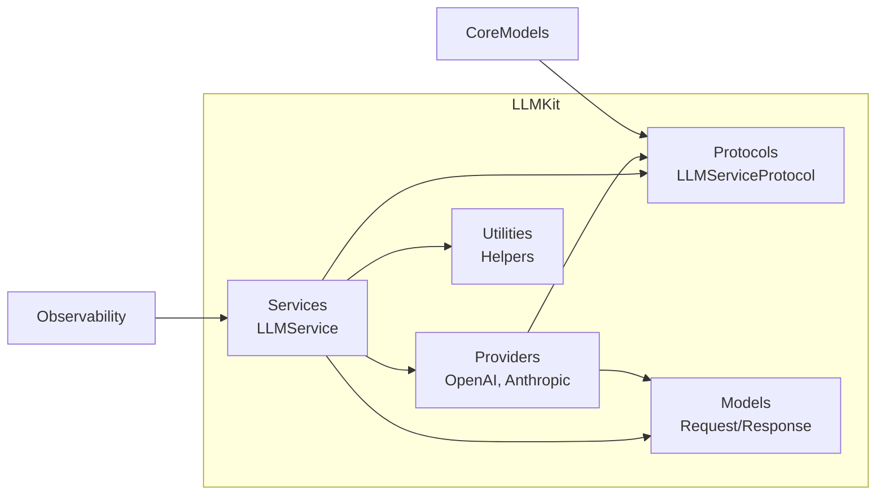
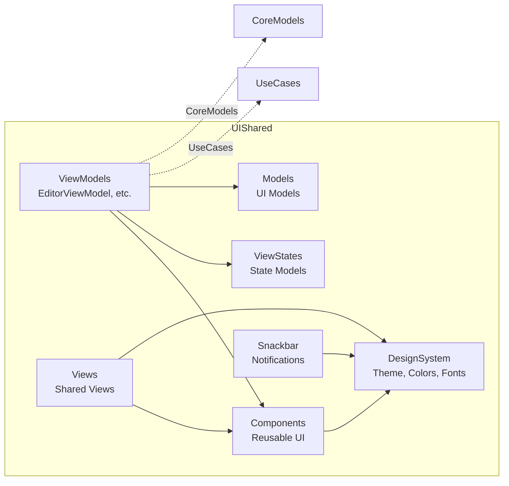
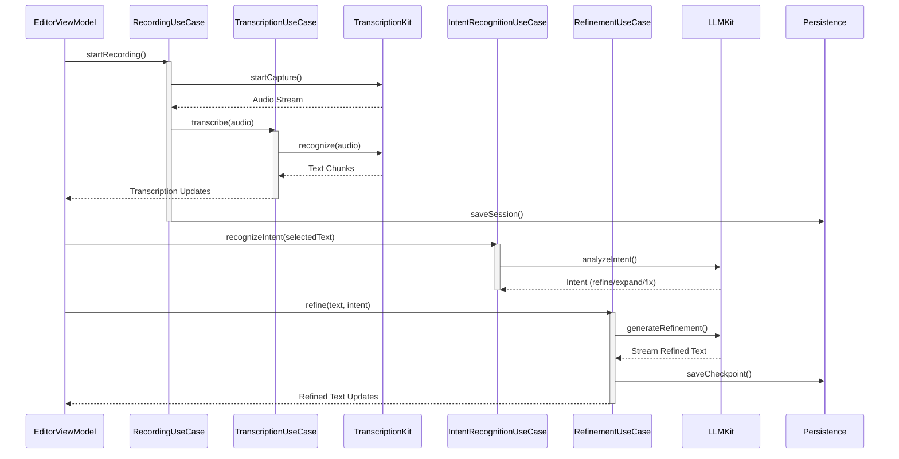
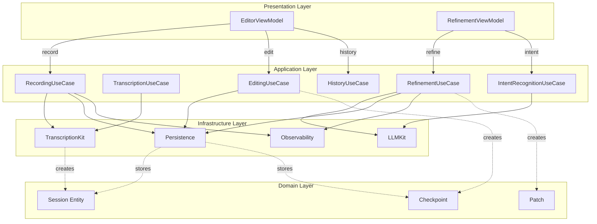
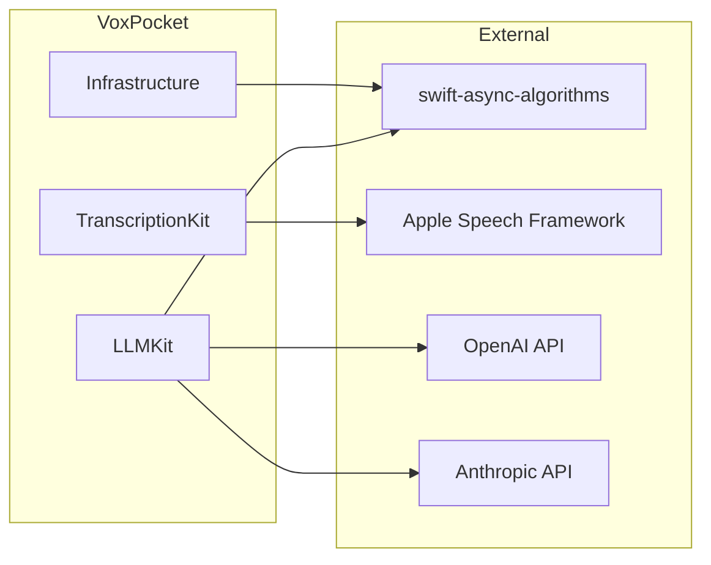

# VoxPocket 依赖关系图

## 包级依赖（Package-level Dependencies）



## 模块内部依赖（Module-level Dependencies）

### LLMKit 内部结构



### UIShared 内部结构



## 用例编排流程（Use Case Orchestration）

### 录音 → 转录 → 精炼流程



### ViewModel → UseCase → Infrastructure 数据流



## 依赖方向规则

### ✅ 允许的依赖方向

```
Presentation → Application → Infrastructure → Domain
Presentation → Domain (直接依赖实体)
Infrastructure → Domain (技术实现依赖实体)
```

### ❌ 禁止的依赖方向

```
Domain ↛ Infrastructure (领域不知道技术细节)
Domain ↛ Application (领域不知道业务流程)
Infrastructure ↛ Application (技术层不知道业务)
Application ↛ Presentation (用例不知道UI)
```

## 外部依赖



## 编译依赖顺序

基于依赖关系，编译顺序如下：

```
1. VoxDomain (无依赖，最先编译)
   ├─ CoreModels
   └─ TextHistory

2. VoxInfrastructure (依赖 Domain)
   ├─ Observability
   ├─ Preferences
   ├─ TranscriptionKit
   ├─ PlatformAdapters
   ├─ Persistence
   └─ LLMKit

3. VoxApplication (依赖 Domain + Infrastructure)
   └─ UseCases

4. VoxPresentation (依赖所有，最后编译)
   ├─ UIShared
   └─ PlatformUI
```

## 循环依赖检测

当前架构 **无循环依赖**：

- ✅ Domain 完全独立
- ✅ Infrastructure 单向依赖 Domain
- ✅ Application 依赖 Domain + Infrastructure，无反向依赖
- ✅ Presentation 作为最外层，只向内依赖

**如何避免循环依赖**：
1. 使用协议（Protocol）定义接口
2. 依赖注入（Dependency Injection）
3. 观察者模式（Publisher/Subscriber）
4. 事件驱动（Event Bus）
